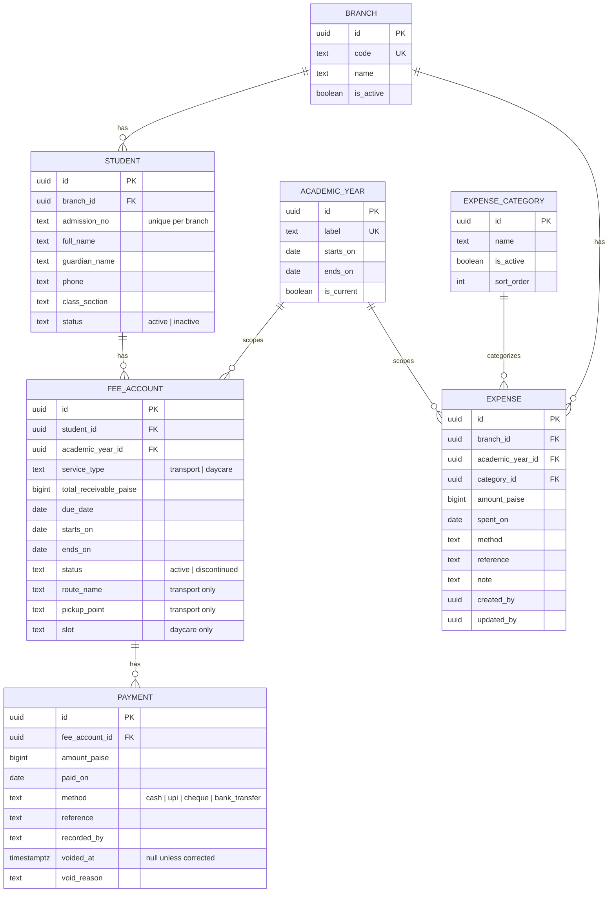

# EK Desk

Internal fee-management app for preschool, covering school transport and daycare fee accounts.

## Stack

Next.js 15 (App Router, TypeScript strict) · Supabase Postgres + Auth · Tailwind CSS v4 · Zod · Vitest · Playwright · Vercel.

See [`CLAUDE.md`](./CLAUDE.md) for the domain model, design system, and project rules governing this codebase.

## Setup

1. `npm install`
2. Copy `.env.example` to `.env.local` and fill in Supabase project credentials.
3. `npm run dev` — starts the app at [http://localhost:3000](http://localhost:3000).

## Scripts

| Command                    | Purpose                                                                                           |
| -------------------------- | ------------------------------------------------------------------------------------------------- |
| `npm run dev`              | Start the dev server                                                                              |
| `npm run build`            | Production build                                                                                  |
| `npm run lint`             | ESLint                                                                                            |
| `npm run typecheck`        | TypeScript, no emit                                                                               |
| `npm run test`             | Unit tests (Vitest)                                                                               |
| `npm run test:watch`       | Unit tests, watch mode                                                                            |
| `npm run test:coverage`    | Unit tests with coverage                                                                          |
| `npm run test:integration` | Integration tests against a local Postgres (needs `db:start`)                                     |
| `npm run test:e2e`         | End-to-end tests (Playwright)                                                                     |
| `npm run format`           | Format with Prettier                                                                              |
| `npm run db:start`         | `supabase start` (requires Docker)                                                                |
| `npm run db:reset`         | Apply all migrations from empty                                                                   |
| `npm run db:seed`          | Generate ~60 fake students, fee accounts, and payments                                            |
| `npm run db:seed:empty`    | Branch/academic-year reference data only, no fake students — for trying the app against real data |
| `npm run db:seed:expenses` | Optional — fake expense rows for the current year                                                 |
| `npm run auth:seed`        | Create the shared local admin login                                                               |
| `npm run screenshots`      | Recapture the landing page's product screenshots (needs a prod build)                             |

## Architecture

- **Routing**: Next.js App Router, Server Components by default. `/transport` and `/daycare` render the same `ServiceScopeDashboard` component parameterised by `service_type` — the aggregation and money logic exists exactly once, per [`CLAUDE.md`](./CLAUDE.md) rule 5. The student-detail view uses a parallel route (`@drawer`) plus an intercepting route (`(.)student/[id]`) so clicking a student opens a slide-over on top of the table on client-side navigation, but the same URL loads as a full page on direct visit or reload.
- **Data access**: reads go through Postgres views (`fee_account_record`, `fee_account_balance`) and `dashboard_*` SQL functions — never raw aggregate `select`s from the app tier, since this Supabase instance has PostgREST aggregate-select disabled. Every filter/sort/page state lives in the URL query string (parsed with Zod server-side) and is pushed into the query, never fetched in full and filtered in React.
- **Mutations**: Server Actions for everything, with a server-side `redirect()` on success rather than a client `router.push`. Route Handlers exist only for the three Excel exports (`/api/export/*`) — a binary download needing a `Content-Disposition` header is one of the two genuine exceptions CLAUDE.md allows; there are no others.
- **Domain layer**: `src/lib/domain/` is pure, framework-free TypeScript (money as `bigint` paise, balance/ageing/collection-rate math) with its own unit tests — the only place arithmetic on money happens.
- **Auth**: Supabase Auth + `@supabase/ssr`, middleware-enforced route protection, no public sign-up — every login (admin or teacher) is created by an admin from Settings. RLS is default-deny; see `CLAUDE.md` for the policy model.
- **Styling**: Tailwind v4, CSS-first `@theme` in `globals.css` — no `tailwind.config.ts`. All colors are the fixed token set in `CLAUDE.md`, no arbitrary hex values.

## Schema

The core money model is seven Postgres tables (`branch`, `academic_year`, `student`, `fee_account`, `payment`, `expense_category`, `expense`) plus a derived `fee_account_balance` view — diagrammed below. See [`CLAUDE.md`](./CLAUDE.md) for the full column list and non-negotiable rules. Migrations live in `supabase/migrations/`.



`fee_account_balance` (and the richer `fee_account_record` view used by the
record table) are derived, not stored: `collected_paise` sums non-voided
payments, `pending_paise` is receivable minus collected, and overdue is
`pending_paise > 0 AND due_date < current_date`, computed at read time —
never written to a column. `expense` is the one exception to append-only
money (`CLAUDE.md` rule 8) — it's spend the office made, not receivable owed
to it, so it's edited and hard-deleted directly rather than voided.

Beyond the money model, three more table groups back the app but aren't
diagrammed above (see `CLAUDE.md` rules 6 and 12 for the full rules, and
their own migrations for exact columns):

- **`profile`** — one row per Supabase Auth user, holding `role`
  (`admin` | `teacher`) and, for a teacher, their `branch_id`. Read via
  `security definer` RPCs (`auth_role()`, `auth_branch_id()`), never by
  trusting a client-supplied value.
- **`student_submission`, `student_edit_submission`, `payment_submission`**
  — a teacher's proposed add/edit/payment queues here, pending until an
  admin approves or rejects it through a matching `approve_*`/`reject_*`
  `security definer` function; nothing here touches `student`/
  `fee_account`/`payment` until then.
- **`activity_log`** — an append-only, admin-only audit trail. A single
  trigger function on seven tables (`student`, `fee_account`, `payment`,
  `expense`, `expense_category`, `student_submission`, `profile`) writes
  one row per row changed; nobody, including an admin, can insert/update/
  delete it directly.

To run against local Supabase:

```bash
npm run db:start          # supabase start (requires Docker)
npm run db:reset          # apply all migrations from empty
npm run db:seed           # generate ~60 fake students, fee accounts, and payments
npm run db:seed:expenses  # optional -- fake expense rows for the current year, for the Expenses dashboard/screenshots
npm run test:integration
```

## Permissions

Two roles, `admin` and `teacher` (`profile.role`), enforced in three layers per
`CLAUDE.md` rule 6 — RLS, `requireRole`/`requireAuth`, and `ROUTE_ACCESS`
(`src/lib/auth/routes.ts`), which is the single source both middleware and the
sidebar nav read. This table covers routes only; a teacher's _row-level_ access
to their own branch's students/fee accounts/payments/expenses is separate and
is granted regardless of which routes below they can reach.

| Route                                       | Admin | Teacher | Notes                                                                                                                                                                                                                                                                                                 |
| ------------------------------------------- | ----- | ------- | ----------------------------------------------------------------------------------------------------------------------------------------------------------------------------------------------------------------------------------------------------------------------------------------------------- |
| `/transport`, `/daycare`                    | ✅    | ❌      | Dashboard aggregates stay admin-only; a teacher's own-branch figures are still visible on `/students`.                                                                                                                                                                                                |
| `/students`                                 | ✅    | ✅      | A teacher's writes (add/edit/delete) go through a `*_submission` queue, never directly.                                                                                                                                                                                                               |
| `/expenses`                                 | ✅    | ✅      | Deliberately open to both, unlike the fee dashboards — see `CLAUDE.md` rule 9.                                                                                                                                                                                                                        |
| `/approvals`                                | ✅    | ✅      | Same route, branched in the page: admin reviews everyone's queue, a teacher reads their own.                                                                                                                                                                                                          |
| `/logs` (Activity log)                      | ✅    | ❌      | Admin-only, same reasoning as `/transport`/`/daycare` — every branch's names, every expense amount, every receivable change in one place. Nobody, including admin, can write to `activity_log` directly; it's populated only by `log_activity()`, a `security definer` trigger (`CLAUDE.md` rule 12). |
| `/settings`, `/settings/expense-categories` | ✅    | ❌      |                                                                                                                                                                                                                                                                                                       |
| `/api/export/fee-accounts`                  | ✅    | ❌      |                                                                                                                                                                                                                                                                                                       |
| `/api/export/expenses`                      | ✅    | ✅      | Clamped to the teacher's own branch server-side, regardless of the query string.                                                                                                                                                                                                                      |
| `/api/export/logs`                          | ✅    | ❌      |                                                                                                                                                                                                                                                                                                       |

`/` (the public landing page), `/login`, `/privacy`, and `/terms` aren't in
this table — they're reachable signed in or signed out, by anyone, with no
role check at all (`middleware.ts`'s `isPublicRoute`).

## Deploying

See [`docs/deployment.md`](./docs/deployment.md) for the one-time production
Supabase + Vercel setup (project creation, environment variables per Vercel
environment, auth redirect allow-list), and
[`docs/importing-existing-records.md`](./docs/importing-existing-records.md)
for bringing the office's existing real records into this schema.

## Screenshots

`public/screenshots/` holds the four images the landing page (`/`) shows
under "What it looks like" — taken against seed data only, never real
student data, per `CLAUDE.md`'s PII rule. To recapture them after a UI
change:

```bash
npm run db:reset && npm run db:seed && npm run auth:seed
npm run build && npm run start
npm run screenshots
```

`scripts/capture-screenshots.ts` signs in as the seeded admin
(`scripts/test-credentials.ts`) and writes each one straight to
`public/screenshots/` via Playwright's own screenshot API — deliberately
against a production build (`next start`), not `next dev`, so the dev-mode
indicator badge never ends up in a shipped image.
