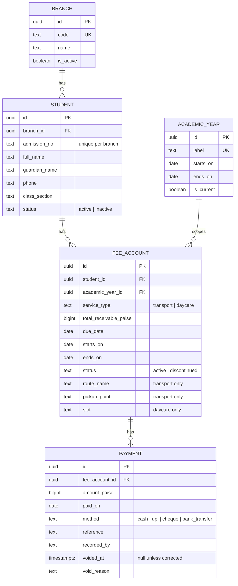

# EK Desk

Internal fee-management app for a EuroKids preschool group with two branches, covering school transport and daycare fee accounts.

## Stack

Next.js 15 (App Router, TypeScript strict) · Supabase Postgres + Auth · Tailwind CSS v4 · Zod · Vitest · Playwright · Vercel.

See [`CLAUDE.md`](./CLAUDE.md) for the domain model, design system, and project rules governing this codebase.

## Setup

1. `npm install`
2. Copy `.env.example` to `.env.local` and fill in Supabase project credentials.
3. `npm run dev` — starts the app at [http://localhost:3000](http://localhost:3000).

## Scripts

| Command             | Purpose                           |
| ------------------- | --------------------------------- |
| `npm run dev`       | Start the dev server              |
| `npm run build`     | Production build                  |
| `npm run lint`      | ESLint                            |
| `npm run typecheck` | TypeScript, no emit               |
| `npm run test`      | Unit + integration tests (Vitest) |
| `npm run test:e2e`  | End-to-end tests (Playwright)     |
| `npm run format`    | Format with Prettier              |

## Architecture

- **Routing**: Next.js App Router, Server Components by default. `/transport` and `/daycare` render the same `ServiceScopeDashboard` component parameterised by `service_type` — the aggregation and money logic exists exactly once, per [`CLAUDE.md`](./CLAUDE.md) rule 5. The student-detail view uses a parallel route (`@drawer`) plus an intercepting route (`(.)student/[id]`) so clicking a student opens a slide-over on top of the table on client-side navigation, but the same URL loads as a full page on direct visit or reload.
- **Data access**: reads go through Postgres views (`fee_account_record`, `fee_account_balance`) and `dashboard_*` SQL functions — never raw aggregate `select`s from the app tier, since this Supabase instance has PostgREST aggregate-select disabled. Every filter/sort/page state lives in the URL query string (parsed with Zod server-side) and is pushed into the query, never fetched in full and filtered in React.
- **Mutations**: Server Actions only, no API routes. Every action does a server-side `redirect()` on success rather than a client `router.push`.
- **Domain layer**: `src/lib/domain/` is pure, framework-free TypeScript (money as `bigint` paise, balance/ageing/collection-rate math) with its own unit tests — the only place arithmetic on money happens.
- **Auth**: Supabase Auth + `@supabase/ssr`, middleware-enforced route protection, one shared admin login (no public sign-up). RLS is default-deny; see `CLAUDE.md` for the policy model.
- **Styling**: Tailwind v4, CSS-first `@theme` in `globals.css` — no `tailwind.config.ts`. All colors are the fixed token set in `CLAUDE.md`, no arbitrary hex values.

## Schema

Five Postgres tables (`branch`, `academic_year`, `student`, `fee_account`, `payment`) plus a derived `fee_account_balance` view. See [`CLAUDE.md`](./CLAUDE.md) for the full column list and non-negotiable rules. Migrations live in `supabase/migrations/`.



`fee_account_balance` (and the richer `fee_account_record` view used by the
record table) are derived, not stored: `collected_paise` sums non-voided
payments, `pending_paise` is receivable minus collected, and overdue is
`pending_paise > 0 AND due_date < current_date`, computed at read time —
never written to a column.

To run against local Supabase:

```bash
npm run db:start   # supabase start (requires Docker)
npm run db:reset   # apply all migrations from empty
npm run db:seed    # generate ~60 fake students, fee accounts, and payments
npm run test:integration
```

## Permissions

Two roles, `admin` and `teacher` (`profile.role`), enforced in three layers per
`CLAUDE.md` rule 6 — RLS, `requireRole`/`requireAuth`, and `ROUTE_ACCESS`
(`src/lib/auth/routes.ts`), which is the single source both middleware and the
sidebar nav read. This table covers routes only; a teacher's *row-level* access
to their own branch's students/fee accounts/payments/expenses is separate and
is granted regardless of which routes below they can reach.

| Route | Admin | Teacher | Notes |
|---|---|---|---|
| `/transport`, `/daycare` | ✅ | ❌ | Dashboard aggregates stay admin-only; a teacher's own-branch figures are still visible on `/students`. |
| `/students` | ✅ | ✅ | A teacher's writes (add/edit/delete) go through a `*_submission` queue, never directly. |
| `/expenses` | ✅ | ✅ | Deliberately open to both, unlike the fee dashboards — see `CLAUDE.md` rule 9. |
| `/approvals` | ✅ | ✅ | Same route, branched in the page: admin reviews everyone's queue, a teacher reads their own. |
| `/logs` (Activity log) | ✅ | ❌ | Admin-only, same reasoning as `/transport`/`/daycare` — every branch's names, every expense amount, every receivable change in one place. Nobody, including admin, can write to `activity_log` directly; it's populated only by `log_activity()`, a `security definer` trigger (`CLAUDE.md` rule 12). |
| `/settings`, `/settings/expense-categories` | ✅ | ❌ | |
| `/api/export/fee-accounts` | ✅ | ❌ | |
| `/api/export/expenses` | ✅ | ✅ | Clamped to the teacher's own branch server-side, regardless of the query string. |
| `/api/export/logs` | ✅ | ❌ | |

## Deploying

See [`docs/deployment.md`](./docs/deployment.md) for the one-time production
Supabase + Vercel setup (project creation, environment variables per Vercel
environment, auth redirect allow-list), and
[`docs/importing-existing-records.md`](./docs/importing-existing-records.md)
for bringing the office's existing real records into this schema.

## Screenshots

Taken against seed data only — never real student data, per `CLAUDE.md`'s
PII rule. To capture them yourself:

```bash
npm run db:start && npm run db:reset && npm run db:seed && npm run auth:seed
npm run dev
```

Sign in with the seeded admin (`scripts/test-credentials.ts`), then capture:

- `/transport` and `/daycare` — the dashboard (stat cards, By branch split
  with `?branch=all`, ageing/collection charts, filterable record table).
- A student's detail drawer (click any row).
- `/students` — the cross-service student directory.

_Not yet embedded here — this repo doesn't have a way to save a rendered
screenshot to a file from the tooling available when this section was
written. Add the images under `docs/screenshots/` and link them here once
captured._
